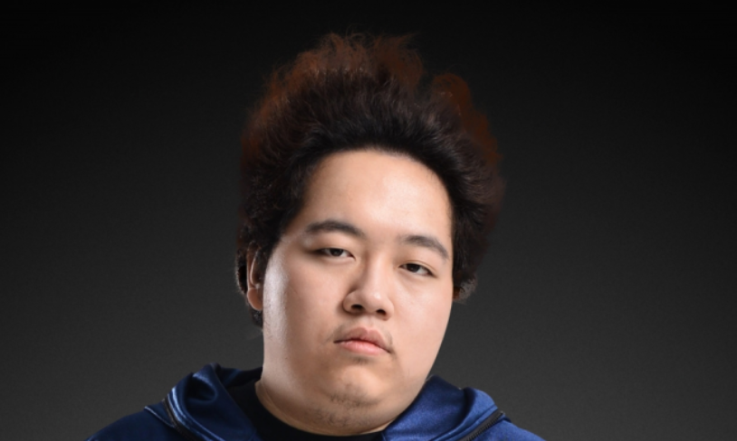
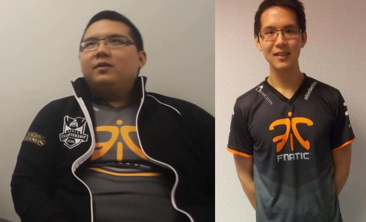

+++
title = "Des cours d'e-sport ? Tu rêves pas frère!"
excerpt = "Et on va taffer là-bas !"
date = 2016-01-14T18:12:45+02:00
tags = ['news']
+++

Salaam, shalom, salut frangin !

Un petit [son](https://youtu.be/m5vw4ajnWGA?feature=shared) pour te mettre bien ? bah oui comme d’hab !

Tu n’es peut-être pas sans savoir que récemment une école propose des cours d’ESPORT ESPORT en Norvège, la Garnes Vidaregåande. Et bien, on a le privilège de t’annoncer que nous serons professeurs là-bas.

[Lien d'un article qui en parle](https://giphy.com/gifs/xTiTnxNLAXV9UmkKZ2)

*La campus*

En effet, nous avons été contactés il y a plusieurs mois de ça, par la direction de cette école qui nous demandait des conseils dans l’enseignement dans le domaine du jeu vidéo et de l’Esport, puis en voyant la qualité de nos réponses et les fortes connaissances que nous avons sur le sujet, ils nous ont proposé deux postes à temps plein dans cette prestigieuse école.

# Vous serez Professeur de quoi ?

Je serai donc professeur dans tout ce qui concerne l’hygiène de vie dans le monde de l’Esport. Un domaine assez large que je maîtrise parfaitement. Et ouais mon frère, être Esport c’est pas graille des macdo et des babké tous les jours, là tu deviens juste fat. Une bonne hygiène de vie c’est Esport, diététique, horaires, la vie quoi.

Tu me crois pas, bah téma se mec : 

*Il s'agit de steak, tu dois le connaître et ouais avec ce pseudo il a la gueule qui va avec !*

Bah lui il a séché les cours… Toujours sceptique ?  Téma YellowStar alors! Quelques cours particuliers et voilà comment il est devenu:

*Il est pa beau comme ça ?*

Devant autant de charisme,  et bah il devient capitaine d’équipe pour Fnatic. Tu vois que c’est indispensable ! J’apprendrai également à nos jeunes élèves comment ne pas se ruiner en prostituées norvégiennes, la gestion de leurs fonds est quelque chose de primordiale également.

Mon comparse, le professeur Kuto, s’occupera de tout ce qui est l’apprentissage du mindgame, et oui car ça s’apprend. Comme tu le sais Kuto est actuellement champion du monde de tous les jeux de versus fighting. Il utilise juste un grand nombre de pseudonymes pour ne pas que son adversaire sache qu’il n’a aucune chance.

# Mais si vous partez que va devenir Nono et Kuto ?

Mais tkt pas poto, t’as cru qu’on allait te laisser solo, sans nous ? Tu ferais comment sans nos magnifiques articles ? On continuera à produire encore et toujours car dans un monde aussi difficile que l’Esport rempli de mensonges c’est notre devoir d’y apporter la vérité. De plus, on profite pour te l’annoncer ici, bientôt sur notre site il y aura des cours d’Esport exclusifs !

Du coup nous ne serons plus sur Geneva, mais nos reporters du ter-ter seront toujours la pour être à l’affût de la moindre information. Notre départ est prévu pour dans 8 jours et on a hâte de pouvoir enseigner ce qu’on sait faire de mieux.

__NK__