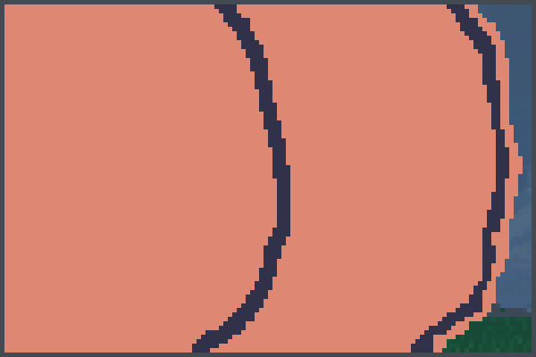
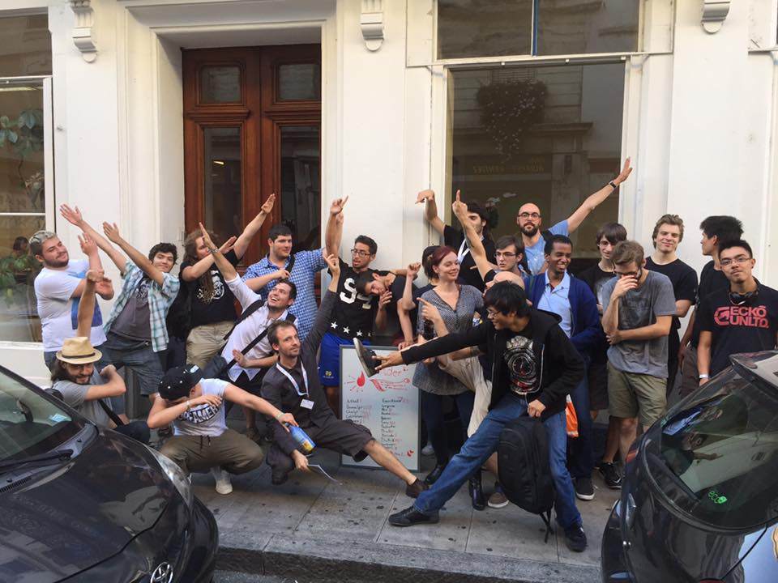

+++
title = "Ce qui ne fallait pas rater"
excerpt = "Clique, ça parle de speed dating !"
date = 2016-09-21T18:22:05+02:00
tags = ['news']
+++

De l’esport à Genève, mais pas que! On est enfin arrivé! We are eSport! We are Legion, petit fan de blizzard mdr

Walléééé. Salut poto comment??? T’as passé un bon été ou quoi?? Nous c’était le feu on vous expliquera les bails d’été de NK. On prendra le temps d’en faire un article parce qu’il y a pas mal de dossiers à traiter hahaha. On essaie de vous faire kiffer au mieux. On a même pas encore commencé que t’as déjà envie de lire.

Petit son [ici](https://youtu.be/gG_dA32oH44?feature=shared)

Voila le son énervé pour la rentrée. On vient se pavaner dans ce game. La difficulté est en mode Facile, tellement on est au dessus de tout le monde.

C’est la rentrée et c’est valable pour nous aussi et frérot, crois-nous on arrive avec du très très lourd. On va épargner personne, ça va taper sec. Supa saijin NK la nouvelle forme bientôt dans dragon ball super. On va commencer par les événements déjà passé ouais poto on était en vacances, mais c’est pas pour autant qu’on va oublier. Les putains vont mouiller leurs panties. On a vu sur les réseaux sociaux certains avaient hâte de notre retour d’autres se chiaient dessus.

T’es chaud ? Nous aussi on commence.

# LA MONTAGNE DE SMASH

CSGTV et leur Montagne de smash que vous connaissez surement, si c’est pas le cas on va rapidement récapituler. Le montagne de smash c’est un tournoi sur le jeu super smash bros 4 Wii U qui est mensuel et qui se déroule à Yverdon-les-bains, je crois au pire balek. Ce qu’on en pense alors ? Le concept est stylé même si c’est un plagiat de la Samus Ness Link, mais la banane malgache vient du fait que le tournoi à ses débuts était payant et sans cash prize.

T’as bien lu ! Tu y vas tu payes ta place tu joues, mais tu gagnes rien en gros c’est comme si tu allais chez ton pote te faire allumer à street et à la fin il te raquette ton biff. Bon ils se sont rendus compte et par la suite ils ont mis un cash-price de 170 francs et un poster d’un pixel art de mon cul. J’avoue avoir un pixel art de mon cul en troisième place c’est plutôt frais. 

*Petit boule, même en faisant du squat t'auras jamais un boule pareil.*

Ils se sont bien rattrapé sur ce coup, mais on doit t’annoncer une chose terrible… On croit que la Montagne de smash c’est terminé. RIP on t’oublie pas. Malgré cette terrible nouvelle on doit continuer et aller de l’avant. On va vite fait te parler de CSGTV (Commentary Swiss Gaming) a.k.a l’avenir du streaming suisse. Ils ont certifiés avoir plus de 1000 vues sur le twitch ce qui met la plupart des streamers français en position latérale de sécurité.

Où est la couille ? Bah ils ont un peu menti c’est des vues totales accumulées depuis leurs début et ils en sont actuellement à 3500 ce qui est pour dire faible. Pour comparer avec un autre géant du streaming suisse malheureusement décédé SGTV (sacré ressemble dans le nom) qui eux sont actuellement plus de 11 000 vues. On remarque que CSGTV est clairement devant mdr.

Pourquoi autant mentir ? On sait pas, mais la vérité a éclaté au grand jour. En tout cas pour le moment ils font profil bas ils doivent préparer la rentrée et revenir avec des projets lourds comme “donne-moi ton argent”. 

# LE SPEED DATING EN MODE ESPORT, CA EXISTE!

On passe au Speed Teaming Overwatch de l’association de nos frères qu’on kiffe Geneva E-Sport. C’est des gars bien eux, ils veulent faire de Genève la capitale de l’esport, mais tu le sais déjà. Leurs nouveaux concepts ? Trouver l’amour dans overwatch. Une version des temps modernes de l’amour est dans le pré en somme.

T’as pas de team ? Tu veux jouer a overwatch le jeu à la mode ? Bah… Tu t’inscris, tu te fais des copains et tu t’amuses. Putain.. C’est génial! Ca te fait marrer ? Nous aussi, mais on tenait à saluer l’effort quand même.

*Les poses victorieuses de gars qui se sont fait pleins d'amis. On salue le dab plutôt réussi en bas à gauche.*

On a pu avec l’équipe de reporter NK recueillir à chaud quelques témoignages exclusifs.

- Cindy
> Merci GES avec votre évent l’amour est dans overwatch, j’ai pu rencontré l’homme de ma vie!

- Kévin
> J’ai bien aimé ce speed teaming. J’ai appris pleins de choses et cela m’a permis de canaliser mes pulsions afin de moins rager sur le jeu.

- Bernard
> Putain à cause de cet événement de merde ma femme m’a quitté pour un autre…

L’événement divise, l’événement partage, mais l’événement est un succès encore bravo.

# Jeux Numériques

On voulait rapidement parler de Numerik Games, car il y a notre poto Zerafut qui y a participé en tant que guest et ça c’est plutôt cool, voila un peu son taff hésité pas a aller faire un tour.

*Dessin de Hanzone et Genji Chirac*

Et ouais mon gars [ça c’est du talent](https://www.facebook.com/zerafut/?fref=ts)

Sinon l’événement rien a redire c’était ouf bravo à l’équipe chargé du projet. Quand c’est bien on le dit aussi, faut pas croire ahaha

On sait il y a eu pleins d’autres événements durant notre absence, mais c’est soit on s’en balek soit on les connaît pas et on s’en balek. On va terminer l’article là mais poto c’est pas fini c’est la rentré on est chaud on t’a présenté les events finis, il y a aussi les events à venir et on te promet autant de maxance : Palexpo, Palladium de quoi de donner envie

__NK__