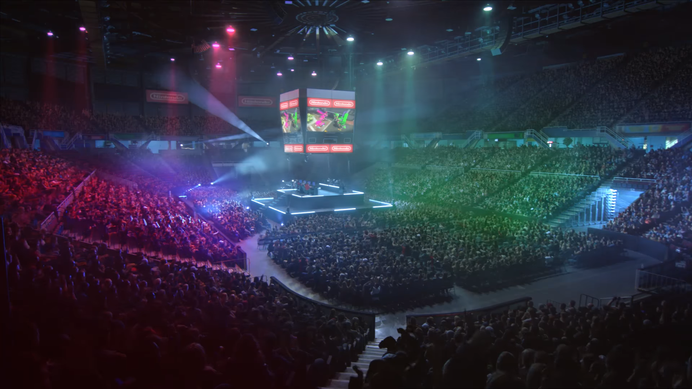
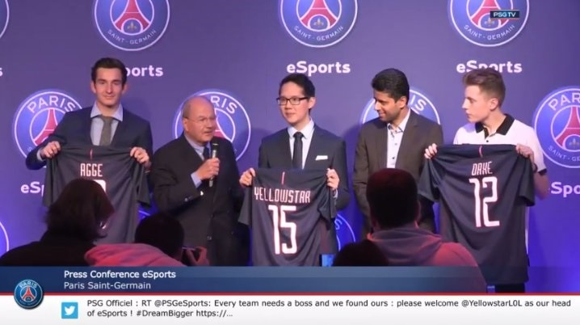
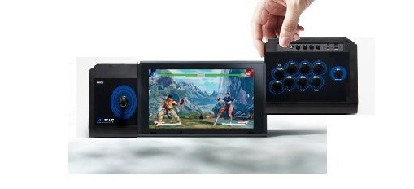
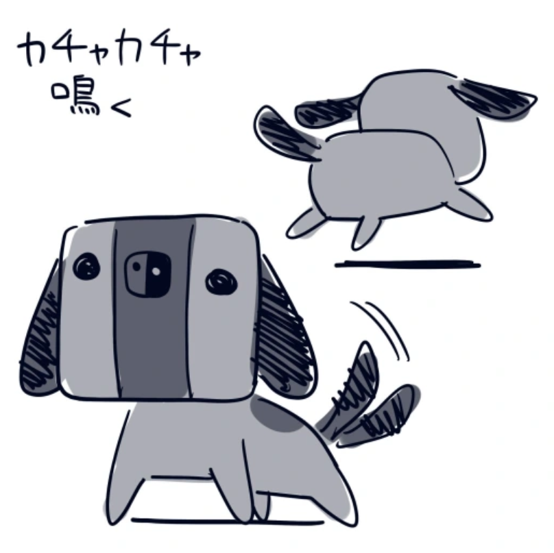
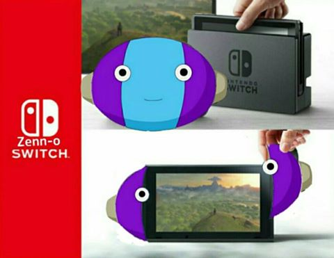

+++
title = "Nentendo Switch - Il en pense quoi NK ?"
excerpt = "Promis c'est sincère"
date = 2016-10-22T18:22:05+02:00
tags = ['preview']
+++

Bah c’est de la merde… Merci.

On se retrouve bientôt pour un nouvel article.

Peace | NK

Ahaha toujours les petites blagues, avoue t’y as cru de ouf.

Petit [son](https://youtu.be/uzUozo1628U) pour l’occaz

Content de te retrouver et cette fois ci c’est un article un peu spécial. On va parler de la toute dernière annonce de nentendo. On va te parler de la NX. Si t’as raté l’annonce voici le trailer officiel :

[First Look at Nentendo Switch](https://youtu.be/f5uik5fgIaI)

Petite musique groovy toussa, nentendo a du goût, enfin on va en reparler !

# Alors NK, la nintendo switch c’est quoi ?

Comme t’as pu le voir dans le first look, c’est la future console de Big N. C’est une console avec un nouveau concept. Elle mélange console de salon et console portable, dont le nom Switch, mais nous on préfère son nom de code NX mdr. On est un peu mi-figue mi-raisin avec Kuto, mais espérons que nentendo coupe bientôt la poire en deux.

# L’annonce de Big N.

On s’y attendait un peu à ce qu’ils nous préparent une petite annonce comme ça de 3 minutes et sans aucunes explications, ça c’est du Nintendo. En dire le moins possible et laisser les gens faire leurs propres suppositions. C’est surtout pour pas se mouiller. On connait toutes les strats, faut se rénover un peu là.  Alors lors de l’annonce on a pu distinguer plusieurs trucs. Ils ont démarré avec le prochain Zelda très attendu par la communauté et ça c’est un bon point, On voit un pti Skyrim, probablement un nouveau Mario, un Mario kart qui a l’air d’être celui sur wii U, Splatoon (ESPORT) et un nba 2k17. On admire surtout la console dans diverses situations du quotidien. Tu peux jouer tout seul comme une victime ou tu peux jouer avec tes potes dehors avec une toute petite manette, toute petite manette, toute petite… On sait pas trop une fois en main comment ça sera mais ça l’air bien relou. En tout cas les gens s’amuse bien, c’est même une technique pour pécho à l’aéroport apparemment.

Pis l’esport les gars. ENFIN! On est vraiment content que Nentendo se mette à l’ESPORT, c’est un grand pas en avant pour eux. Pis faut dire ce qu’y est Splatoon c’est un main, avec Kuto on est à fond dessus.

# La console

Ça reste plutôt prometteur, on va t’en parler un peu sans aller trop dans les détails parce que personne les connais les détails pas même nentendo apparemment.

Comme t’as pu le voir ça se plug/deplug de partout c’est genre un lego le bordel. On sait que c’est nvidia qui est à l’ origine de l’infrastructure ce qui pourrais nous laisser présager du bon.

[https://blogs.nvidia.com/blog/2016/10/20/nintendo-switch/](https://blogs.nvidia.com/blog/2016/10/20/nintendo-switch/)

Si t’as envie d’avoir un tout petit peu plus de détails. On sait aussi que la rétro-compatibilité c’est mort. Ce qui est un très mauvais point.

> Oui mais NK tarace les concurrents ont pas de rétro-compatibilité.

Oui oui certes certes, mais petit fragile, ce n’est pas parce que les concurrents ne font pas que tu ne dois pas faire. C’était un énorme avantage qu’avait la wii et la wii U pourquoi le perdre ? On sait aussi que les jeux de la Switch seront sur des petites cartouches un peu comme des cartes SD, mais on en sait pas plus. Apparemment ils aiment bien faire petit chez Nentendo.

Ce qu’on sait aussi et qui est plutôt cocasse, même si ça à rien avoir avec la console, c’est que Bethesda n’a en aucun cas confirmé un Skyrim sur la prochaine console de Nintendo.

# Les craintes

Nos plus grosses craintes c’est dans un premier lieu bien évidemment le catalogue de jeux de la console. Tu sais aussi bien que moi que la wii U et la 3ds ont souffert longtemps du manque de jeu et c’est pas 1 ou 2 Mario en 3D qui allait rattraper le coup. Le plus grosse question qu’on se pose également c’est l’autonomie de la console en dehors de son socle et simplement sa solidité. A force d’enlever et remettre les manettes, le petit machin derrière qui sert a tenir la console debout qui a l’air d’être bien fragile. Et oui aussi si on peut jouer qu’une heure en dehors de son socle d’alimentation c’est plus trop une console portable… On est un peu sceptique aussi a voir un écran full HD, mais on ose espérer quand même on est en 2016 ahah

# Bref pour conclure rapidement

C’est rigolo, on attend de voir, ça promet d’être bien, mais ça sera sûrement pas bien.

Il c’est passé pleins de trucs aussi cette semaine dans le monde du game. Rockstar qui nous sort son nouveau Red Dead Redemption, le pc du turfu… Shadow  (un peu dark le nom) on te laisse faire tes propres recherches. YellowStar capitaine de l’équipe ESPORT du PSG.

*Tellement classe ! On avait déjà parler un peu de lui dans un ancien article.*

On va finir par quelques trucs qui nous ont fait marrer sur l’Internet

*Une version switch pour les doseurs de Street*

Problème avec la console: [https://twitter.com/Millenium/status/789490485278769152](https://twitter.com/Millenium/status/789490485278769152)

*Ca ressemble à un iench non hahahh ?*

Les collègues de Semper Ludo nous ont fait beaucoup rire:
> Dévoiler une manette au nom de Joy-Con, pour nous amateurs de jeux de mots, c’est un peu comme laisser un bébé jouer avec un pistolet.

Un petit dernier tout chaud pour le plaisir:

*Il nous a plié celui-là*

# La vraie fin

Voilà poto on a encore trop de trucs à te raconter. Les prochains films de super héros pour 2017. L’article sur DBS qui tarde. La nouvelle tendance auprès des jeunes filles aux gros culs et aux gros seins : le keijo mdr. Tkt on te promet que ça arrive très bientôt

__NK__

