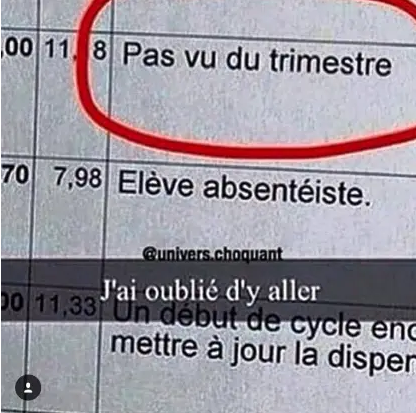

+++
title = "Nono ça dit quoi ?"
excerpt = "Édition novembre 2016"
date = 2016-11-30T18:22:05+02:00
tags = ['nono', 'news']
+++

Yes poto on se retrouve mais cette fois-ci en tête à tête, juste toi et moi. J’t’explique c’est mon nouveau concept. J’vais te parler un peu de ce qui se passe dans ma life, ce qui m’a fait marrer la semaine, ce qui m’a choqué, ce que je regarde, à quoi je joue, bref c’est un petit moment de pur intimité avec Nono. Kuto fera peut-être de même, mais ce n’est pas sûr en ce moment il est très occupé sur des bails screds. Je vais essayer de construire l’article de la même manière à chaque fois, c’est un peu le pilote. Et j’vais faire une promesse, même si j’ai pas de race, ça sera un rendez-vous tous les mercredis. Je promets des trucs mais je le ferais pas tu commences à bien nous connaitre.

Comme cette histoire de stream, on a oublié mdr

Donc t’as compris c’est un putain d’article qui va regrouper toute la connerie que j’ai vue ou vécue pendant une semaine.

C’est partie avec le comme DAB les sons du moment. Les sons lourds que j’écoute en boucle.
- [Son 1](https://youtu.be/fbOmB-ENr9Q)
- [Son 2](https://youtu.be/wOy2RJze7fA)
- [Son 3](https://youtu.be/rbmcxs4SU88)

# L’actualité en retard

T’étais pas sans savoir que vendredi passé (le 25 novembre) c’était le Black Friday. Là tu me diras mais espèce de connard le Black Friday c’est un événement pour les gros américains et tu as tout à fait raison, mais pas seulement car depuis quelques années surtout cette année (c’est pour ça que j’en parle t’as compris t’es pas con), ça s’est énormément popularisé dans tous les continents. La Suisse ne fait pas exception avec des magasins comme Interdiscount ou Fnac et j’en passe. Alors je te rappelle le principe du Black Friday, c’est un prétexte pour aller mettre des immenses balayettes et des coups de coudes à la Booba à des pauvres connards qui deviennent fous pour une baisse des prix du efion 8 ou de la dernière télévision 16k à la mode.  Comme dirait la psy4 le monde est stone mdr

Sinon j’ai vu passer une info sur Twitter récemment, elle date un peu plus, mais je voulais t’en parler car c’est vraiment fou comme concept.  BLOWCAST ! Alors c’est quoi ça ? C’est simple c’est un système qui permet d’acheter une fellation simulé auprès de femmes  (des camgirls). C’est dégueulasse ? Comment ils font ça ? Non c’est pas dégueulasse c’est génial et pour répondre à comment ils font ça, on utilise un Kiiroo Pearl, un godmichelle (merci jaquie et michell) connecté à la meuf qui va récupérer les données sensorielles de sa fellation et les retranscrire dans une chatte en plastoc connectée et c’est parti pour la fellation. Ça donne pas envie d’essayer ?
Après ouais ça pose beaucoup de polémiques, mais je suis pas là pour parler de ça, sauf qu’une question m’a frappé au visage comme une patate de Saitama. Comment on peut être sur que la fellation sélectionnée est celle faite par une meuf ? Cette question m’a titillé quelque temps pis je me suis dis, ça doit être comme le porc dans la religion musulmane si tu sais pas que c’est du porc, c’est pas pêché.

Si tu veux plus d’infos t’as google, j’suis pas là pour te donner des liens mdr.

Voilà pour mon actualité, maintenant je vais te parler d’art ! Ouais vaguement je vais te parler de séries, animes, mangas, films enfin bref ce que j’ai vu ou écouté et qui mérite que j’en parle.

# Naruto c’est énervé

Bon si t’es un vrai tu es pas sens savoir que Kuto et moi on est des fans de Dragon Ball du coup chaque semaine je vais revenir rapidement sur l’épisode de Dragon Ball Super.
J’ai bien dit rapidement, car je suis pas là pour faire une analyse d’épisodes je vais juste te dire si j’ai kiffé ou pas, et c’est pas garanti que chaque semaine je m’exprime dessus. L’épisode de cette semaine c’est un HS, voila fini. Et ça le sera pendant quelques semaines. C’est drôle, on rigole tout le monde il est rigolo, bref. Goku invoque Shenron pour le spoil gratuit.
J’ai quand même envie là de te parler un peu plus de mon ressenti de l’arc de mirai Trunks et de sa conclusion. Je suis partagé pour tout te dire ça oscille entre J’ai trop kiffé et le niksarace. Globalement, j’ai aimé, j’ai surtout aimé l’épisode final et comment l’arc se conclut. J’avoue aussi être redevenu un gamin devant la fusion de Goku et Vegeta qui était certes attendue mais qui a quand même fait son effet. On a hésité a fusionné avec Kuto, mais les gens sont tellement pas prêts à autant de puissance.
Après je vais pas te le cacher, beaucoup de trucs m’ont gêné de manière générale. Le point qui est le plus souvent reproché à DBS c’est son animation pitoyable sur plusieurs épisodes mais dans cet arc on a eu justement le droit à des scènes d’une qualité irréprochable.  C’est le meilleur arc de l’anime pour le moment, mais ça ce n’était pas bien difficile.

Sinon mon pote j’ai maté Keijo pour la science. Au départ je voulais faire un article complet la dessus, mais ça m’a vite fait chié. Je n’arrive pas à comprendre comment l’internet a pu s’extasier autant sur un anime pareil. J’suis choqué et déçu comme on dit.
Je vais t’écrire le [synopiptangopag](https://fr.wikipedia.org/wiki/Trigonom%C3%A9trie) : Des filles en bikini combattent sur une arène flottant sur l’eau.

Voilà c’est une nouvelle discipline sportive féminine qui consiste à expulser son adversaire en dehors de l’arène flottante à coup de poitrines et de culs. En effet c’est les seules parties du corps qui sont autorisés à être utilisées.

J’ai pas résister je te mets un extrait :

PS : c’est un AMV de merde balekouille, coupe le son mdr (oui j’ai fait exprès)

Du coup frère je me suis demandé si cette idée absurde existerait dans la vraie vie sa donnerai quoi ?

Bah ça ressemblerai a un truc un peu comme ça :

*J'crois, j'étais bourré quand j'ai fait la censure*

Et ça mon frère, t’es d’accord avec moi on paye direct pour ?
Bref t’as compris c’est de la merde remplie de fan service, c’est fait pour, certains trouveront ça drôle, genre mdr ses fesses peuvent mordre, mais perso j’ai dû sourire une fois en matant 5 épisodes.

# La mort est une journée qui mérite d’être vécue

Du coté des films j’ai maté que des films de merde récemment, des étrons qui passaient à la tv, du genre sexe entre amis, Hansel et Gretel : chasseurs de putains…sorcières pardon. Ou bien encore Qu’est-ce qu’on a fait au Bon Dieu, sur lequel je vais quand même m’attarder un peu.

Tu l’as pas vu, je vais te résumé ça, c’est un film ou tout le monde est raciste et le film est bourré d’amalgames, pareil j’ai dû sourire une fois sans plus. Après avec Kuto on est les premiers à qui ça fait rire ce genre de conneries des clichés on s’en cache pas, j’aurais peut-être trouvé le film plus amusant si c’était pas centré autour d’une morale fédératrice : Aime ton prochain aimez -vous les uns les autres. Vous avez le même point commun, vous êtes racistes. Une comédie pas drôle de plus à classer dans les films ratés français. D’ailleurs si t’as des films à conseiller hésite pas à nous les partager on les regardera probablement jamais.

# Je suis un hacker brésilien qui vit à Atlanta envahi par des zombies

Pour les séries j’ai maté Mr. Robot, 3% et la je mate Atlanta. Ces 3 séries c’est de la bête de bombe ! Je te les conseille vraiment. J’en parlerai peut-être plus en détails  (surtout pour Atlanta c’est hilarant) si j’ai la motivation d’en faire des articles séparés avec Kuto, mais on n’est pas des critiques. Au final on y connait pas grand-chose on kiffe ou pas ahah

Ça commence à faire long mais j’en parle ou pas ? Ouais j’en parle. Walking Dead MDR
WDMDR. Nouvelle saison, nouvelle merde, mais cette fois-ci les gens s’en rendent compte, que des baisses d’audiences depuis le premier épisode, bientôt il y aura plus que les personnes qui ont voté pour Copé en France. T’as pas encore vu l’épisode de cette semaine ? Je vais te spoil, tu vas te faire grave chier.

# Bref

C’est fini, j’espère tu kiffes le nouveau format qui arrivera toutes les semaines du coup, comme je l’ai dit je vais essayer d’être rigoureux dans les délais et la construction de l’article, mais poto tu sais aussi bien que moi que c’est mort. Ah oui j’ai un voisin qui s’appelle Blackburne c’est l’information la plus inutile du monde mais je devais te la partager. Imagine frère tu t’appelles comme ça c’est chaud quand même.  Voilà ragez pas trop les haters  du fait que j’ai dit que Keijo c’était de la merde, parce que je m’en fous de vos avis et que vous savez que c’est de la merde au fond.

PS : Savez-vous pourquoi je me vide les [couilles](https://www.youtube.com/watch?v=fjjZCONUzl0) avant de prendre l’avion ? Pour éviter l’excédant de bagages.

__Nono__