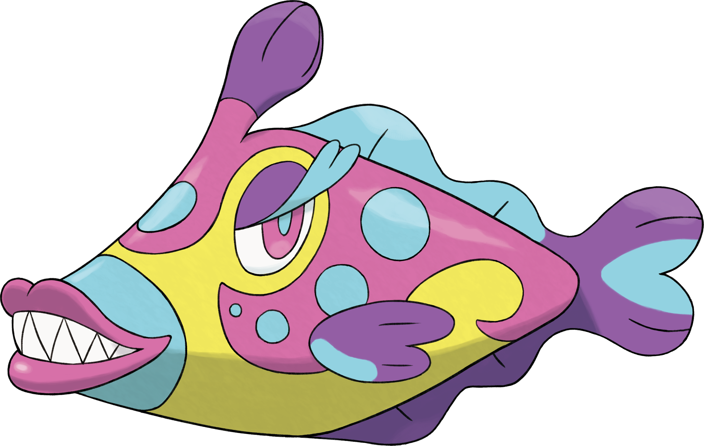
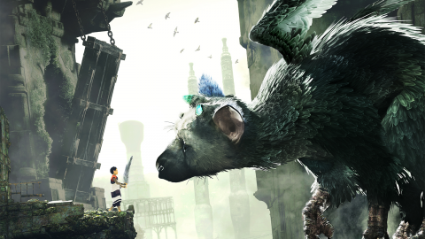

+++
title = "Nono ça dit quoi ?"
excerpt = "Édition décembre 2016"
date = 2016-12-07T18:22:05+02:00
tags = ['nono', 'news']
+++

On se retrouve poto pour le petit rituel, au programme son, jeux vidéo, séries et téléréalité. La semaine dernière j’ai omis volontairement de te parler de plusieurs trucs pour pas que l’article soit aussi long que les travaux de maturité de certains.

# Double discours

J’espère que t’es chaud parce que moi je le suis. C’est parti avec le [dernier son](https://youtu.be/Q-tW-qI52Us?feature=shared) de Médine sorti hier.

T’es pas sans savoir que Médine fait partie de mes rappeurs préférés, même simplement de mes artistes préférés. Ces derniers temps, j’étais revenu un peu au rap old school, je trouvais que le panel qu’offrait le rap était un peu sans saveur. C’est un kebab bas de gamme, même si je m’enjaille bien sur du PNL ou du Booba, Kaaris, mon cerveau avait besoin de textes avec une certaine réflexion derrière. Je trouve que le clip est bien réalisé (vnr sa veste). On y voit son fils qui joue le rôle de Global (son nom d’artiste avant d’utiliser son prénom comme blaze). Je suis pas là pour déconstruire son texte. Pourquoi ? Parce que je sais pas faire ça mdr.  Bref j’ai hâte d’écouter son prochain album Prose élite qui sort le 24 février, surtout qu’il annonce la couleur :

> Mon meilleur album c’est celui qui n’est pas encore sorti.

- Biopic c’est [cadeau](https://youtu.be/HGX6xtyvepI?feature=shared)
- Et vu que je suis vraiment de bonne humeur je t’en laisse [un dernier](https://youtu.be/Kz1--xKCS_g?feature=shared)
- Une [masterclass](https://youtu.be/Kz1--xKCS_g?feature=shared)

Ahahah Ce lien-là c’est une blague, c’est pour te montrer la différence entre un artiste et une merde.

# « Mais je ne comprends pas » – Kim, les marseillais

Je sais pas trop par où commencer, gros faut supprimer la télé ces derniers jours il y a une multitude de programmes de merde qui ont vu le jour. L’autre jour j’ai maté la tv et j’ai vu passer une téléréalité où le but c’est de se marié sans avoir rencontré la personne.  Putain frère je sais même pas trop quoi te dire, c’est tellement absurde des mariages organisés sous prétexte d’une expérience bidonnée. Je suis allé me renseigner vite fait sur le net, il y avait 8 personnes qui ont participé, 4 hommes et 4 femmes donc 4 couples, 2 ont choisi d’arrêté avant le mariage et les deux autres ont divorcé peu de temps après. Mdr bien sur ils s’attendaient à quoi ? J’aimerais bien passé leurs tests de compatibilité. Ça doit être des questions du genre

- Quelle est votre couleur préférée ? J’en ai pas
- Aimez-vous les frites ? Oui
- Aimeriez-vous faire du porno ? Oui
- Pratiquez-vous la sodomie ? Oui

Vous êtes compatible avec Remy Lacroix à 89%

Putain bande de connards les points communs ça fait pas tout, mais en vrai si t’es grave en chien de meuf tu participes à une émission comme celle-là t’as un mariage et surtout une lune de miel payée par la prod du coup tu la dérouilles salement. C’est Tinder l’émission, d’ailleurs je parlerai peut-être un jour des applications de dating.

Sinon il y a un tout nouveau truc c’était diffusé lundi je crois, l’amour food. Le concept de l’émission c’est des cuisiniers professionnels célibataires qui doivent séduire des prétendantes avec leurs plats.

Autant te dire que c’est autant de la merde que toutes les autres téléréalités ils savent vraiment plus quoi inventer c’est d’une tristesse. Par contre je peux comprendre, personnellement je pense pouvoir me faire séduire avec de la nourriture. J’ai une petite anecdote à ce propos. C’était la St Patrick et on a fait une soirée avec Kuto et des frères, sacré soirée mon pote on avait écrit un article dessus mais on l’a jamais publié. On a pas assumé mdr. Bref lors de cette soirée on a rencontré un groupe de meufs avec qui on a trainé et bu quelques verres, et le feeling était passé avec l’une d’elle (D’ailleurs hésite pas a me contacter mdr) . En fin de soirée 1 ou 2 heures du matin Kuto m’a lâché pour manger un kebab, du coup j’étais seul avec la meuf, mais j’étais beaucoup trop dans le futur, j’ai préféré rejoindre mon gars sûr au kebab et graille plutôt que essayer de serrer ahahah Tout ça pour dire que la nourriture c’est sacré mon pote.

# Je suis Sacha et je viens du Bourg-Palette (et je veux niquer Ondine)

Le seul jeu auquel j’ai vraiment joué ces derniers temps c’est Pokéfion Lune, le nouvel opus. Nono t’es un gamin mdr. Ouais peut-être, mais sérieux j’kiffe bien ahaha Ils ont créé pleins de nouveaux pokefions et je voulais t’en montrer un, c’est probablement le pokémon le plus moche jamais créé

Putain d’immondice, imagine une seule seconde qu’un truc pareil existe. C’est chaud tu te barres en courant.

*Merde tuer moi tout de suite svp*

Sinon poto je voulais te parler de la grosse sortie du video game, une image vaut mieux que mille mots

Il est sorti hier officiellement, je vais probablement me le prendre dans bientôt. L’enfant légitime de Shadow of Colossus et Ico. Frère, tu ne peux pas savoir comment j’ai hâte de jouer à ce jeu.  Ces jeux sont des ovnis les meilleures expériences vidéoludiques que j’ai pu avoir, j’espère qu’il sera à la hauteur de ses parents.

# Who wants to be king ?

Je vais te parler de ma série préféré Vikings qui a repris sa saison la semaine dernière. Mon pote cette série c’est une tuerie elle est vraiment énervée, tu suis les aventures de vikings plus précisement de Ragnar Lothbrok, joué par Travel Fimmel. En quoi c’est important ? C’est important car ce type c’est le rôle de sa vie Ragnar il est fait pour le personnage et il joue incroyablement bien. Les fans de blizzard l’ont probablement kiffé dans Warcraft, mais la je te jure son jeu d’acteur est exceptionnel. Bref cette série ça se tape dessus, ça boit, ça baise, ça pourrait s’arrêter là que ça serait déjà bien, mais c’est tellement bien construit. Il y aussi l’une des plus belles femmes du monde qui joue dedans. Vraiment je t’invite à aller la regarder.

Attention le lien ci-dessous spoil une partie de la série, vu que c’est ma série préféré et que je te la conseille vraiment, frérot commence tout de suite à la regarder et sinon si tu t’en fous du spoil, c’est la scène qui respire le plus la testostérone.

[Le trailer ici](https://youtu.be/T4oluLrYczo?feature=shared)

Sinon je mate Gotham que je pense lâcher, l’acteur qui joue Bruce Wayne est d’un énervant, mais pas de la bonne manière comme Joeffrey dans GoT là il est juste casse couilles. Et le jeu d’acteur de manière globale dans cette série est à chier. C’était sympa la première saison mais la c’est juste des enquêtes policières sans grande importance autour de l’univers de Batman.

En parlant d’enquêtes policières sans grande importance on a Lucifer, ça m’attriste un peu car la saison 1 de Lucifer était tellement bien et tellement prometteuse pour la suite et la plus je la regarde plus elle me déçoit ou m’énerve… Je vais te faire rapidement un résumé. Lucifer, c’est l’histoire du Diable qui en a marre de régner sur les Enfers et qui décide de prendre des vacances très prolongées à L.A la ville des anges. En quoi la saison 1 était stylé ? Parce que Lucifer c’est un gros connard narcissique, manipulateur, drôle, riche qui est propriétaire d’une boite de nuit et qui vit une vie de débauche sans fin et qui aide accessoirement la police de L.A à sa façon. C’est rempli d’humour, un mélange de gras, de finesse, d’humour noir, de métaphores de comparaison avec le paradis l’enfer. Bref je te la conseille quand même c’est remplis de bonne idées.

Pour finir cette semaine j’ai pas eu le temps de téma des animes, ni même DBS, ouais j’sais honte à moi, j’en parlerai mercredi prochain je pense, mais en ce moment les animes ça me fait pas trop envie, j’suis hypé par la suite de My Hero qui j’espère arrive bientôt mais le reste me donne pas trop envie. Je serais un super héros de dingue si j’étais dans MHA, genre vision sous les vêtements ou un truc du genre.

Les bonnes choses ont une fin et c’est comme ça que je vais finir l’article d’aujourd’hui. Ah non j’vais te mito, annoncer pardon, des trucs. NK va lancer sa propre marque de vêtements et on va stream vendredi 30 décembre soirée spécial 100 000 abonnés Youtube.  J’espère que ces annonces te font plaisir, garde la pêche mon pote.

__Nono__