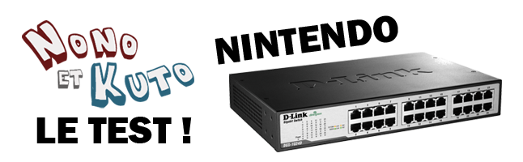
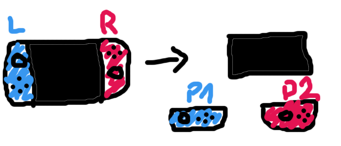
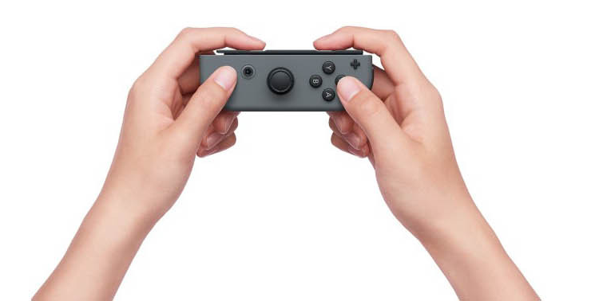

+++
title = 'On a testé la Nentendo Switch'
date = 2017-02-22T10:28:48+02:00
excerpt = 'Ok les frères, on est allé à JI pour tester la Nentendo Switch !!!'
tags = ['test']
+++

Ok les frères, on est allé à JI ce week-end. Pour rappel la JI c’est en gros un Polymanga en plus petit, mais plus stylé. Parce que t’as des trucs à faire au moins mdr.

Des bails du japon genre cérémonie du thé, concours de talents, schnekinette qui danse sur des musiques [AKB48](https://www.youtube.com/watch?v=fj6iDHciEmA) et toussa… ça respecte vraiment le genre.

Alors que Polymonga c’est le youtube game… la grosse machine a fric… mais ça c’est des autres histoires on n’est pas au courant (tkt on te prépare l’article).

Bon on va parler de la Switch maintenant cet article est là pour ça surtout qu’on a fait un article spécial JI mdr, on a plein de choses à dire… chez NK on est un peu partagé en vrai. Mais on va essayer de rester objectif, mais tu sais que c’est dead.

# L’introduction
Ok avant c’était pas une introduction mais là s’en est une. On débarque à JI voilà et on voit au fond du grand couloir le stand Switch assez reconnaissable avec du [rouge règle](http://missfrottis.blog.lemonde.fr/2012/09/19/la-couleur-la-quantite-et-la-duree-des-regles-normales/) partout. On est chanceux, il y a pas trop de monde, mais faut faire la queue… On arrive à ~~raquetter~~ gratter un pass VIP, du coup on passe sans faire la queue en foutant bien le seum au sécu.

D’ailleurs parlons-en un peu, le mec il est devenu fou, il avait des ordres très stricts ne pas faire entrer NK, mais tu nous connais on est des pros de la filouterie on est rentré à JI de la même manière alors que nos têtes étaient en mode Wanted à la One Piece 200 000 000 de berrys. OK OK Nono & Kuto les supernovas tu connais.

# Le mode portable type A
Direct devant nous, 4 clochards qui jouent à la switch en mode portable. C’est le mode où tu prends ta switch comme un écran et que tu détaches les manettes pour en faire 2 manettes distinctes. C’est compliqué à expliquer mais j’te montre un dessin:

*Restecpez notre dessin mdr*

J’appelle ça le mode portable type A a.k.a je vais en vacances avec ma switch et mes potes qui n’ont pas la switch parce qu’ils ont été trop intelligents pour le coup.

Premier point: La manette est beaucoup beaucoup beaucoup trop petite.  On voit déjà venir les mecs la perdre. J’sais pas quel fdp à eu l’idée de faire ça mais c’est trop petit.

De plus, on remarque que les joypads ne forment pas une [symétrie centrale](https://fr.wikipedia.org/wiki/Sym%C3%A9trie_centrale).  En effet le joypad droit (rouge sur notre magnifique schéma) possède le joystick au centre de la manette…

*Mais tout vas bien...*

# Le mode console type A
Devant nous toujours, 3 bornes avec ARMS comme démo. Ce mode c’est le mode console type A a.k.a je suis chez moi je joue sur ma TV et les 2 manettes dans chacune de mes mains comme si c’était une Wii.

Alors les manettes, toujours trop petites, selon nous, mais passent mieux dans chacune des mains. Cependant c’est moins confortable que le combo Nunchuk/Wiimote.

Si on parle 2 secondes de ARMS: Je pense que c’est le jeu qui vaut le détour. Hormis Zelda, ça doit être le jeu à doser sur Switch les premiers mois à venir. Il est assez marrant et facile à prendre en main. Il possède les éléments de base d’un jeu de combat: Contre, Esquive, Garde, Fury/Special attack, etc.  Le jeu est à surveiller de près, il a un grand potentiel d’ESPORT ESPORT.

# 1,2 Switch
On a testé 1,2 Switch. Si vous avez vu la pub de Nentendo, vous savez ce que c’est. Mais en gros c’est des jeux démos pour montrer ce qu’on peut faire avec les manettes.

Il y avait 4 jeux:

– Traire une vache où il faut récolter le plus de verres de lait possible

– Un jeu de cowboy où il faut tirer le plus rapidement possible sur son adversaire

– Un jeu de sabre où il faut trancher son adversaire avant qu’il contre le coup

– Un jeu où il faut deviner le nombre de billes dans une boite simulées par les vibrations de la manette

Dit comme ça, ça a l’air bien pourri. Ben ça l’était en fait. Je donne quand même une mention spéciale pour le dernier jeu avec les [vibrations HD](http://media.laredoute.com/products2/641by641/f/b/9/500380732_0_PR_1_1200.jpg) comme ils appellent ça.

Quand t’avais 2 ou 3 billes ça allait, la sensation était pas mal. Mais au-delà, c’est dead.

Ah, et le jeu n’est pas compris avec la Switch si jamais hein… C’est pas comme Wii Sports à l’époque de la Wii. C’est une putain de démo technique que tu vas payer mdr

1, 2, Switch, 60 CHF chez nous. Ca fait cher pour traire des vaches et  se prendre pour [Lucky Luke](https://www.youtube.com/watch?v=JH3tWsOMvI4) et [Samurai Jack](https://www.youtube.com/watch?v=e51hgWIsY4M).

# Zelda le souffle de la nature [(belle trad)](https://translate.google.ch/?oe=utf-8&client=firefox-b-ab&gfe_rd=cr&um=1&ie=UTF-8&hl=fr&client=tw-ob#en/fr/Breath%20of%20the%20wild)
On a pas testé parce qu’il fallait être dans la guest list. On a essayé de niquer le système une 2e fois mais bon… Du coup on a capturé des gens dans le noir pour qu’ils nous donnent des infos. On va pas dire ce qui était bien dans Zelda parce que tout le monde connait la série et tout le monde sait que c’est de la frappe. On va plutôt noter ce qui était à chier:

Aliasing sur écran TV, baisse de frame rates et ralentissements. Merci au revoir.

# Conclusion
On va conclure sur ça. En gros la Switch, annoncée à 299 $ aux US et 299 € en Fronce, naturellement coutera 350 CHF ici parce qu’on est des pigeons. Tu comptes Zelda à 70 CHF ça fait grosso modo 420 CHF pour jouer à Zelda mdr. On va être honnêtes, sans Zelda, la Switch [c’est zéro](https://www.youtube.com/watch?v=dHkSaxRqhu8). Le prochain jeu cool, c’est Mario Odyssey qui sort à la fin de l’année mdr.

Du coup, t’achètes la Switch + Zelda, 420 CHF. Tu fumes le jeu en 1 mois et tu la ranges jusqu’au 31 décembre si t’as de la chance.

Erratum: Ok, Fnac ont capté la quenelle de Nentendo, ils ont préparé un bundle Switch / Zelda pour [390 CHF](http://www.fr.fnac.ch/n461158/Bonnes-affaires-jeux-video/Offre-Nintendo-Switch-Zelda-breath-of-the-wild#bl=42775-Gaming-Mosaique-switc-537#int=S:Bonnes%20affaires%20jeux%20vid%C3%A9os|Jeux%20vid%C3%A9o|NonApplicable|NonApplicable|BL3|NonApplicable). Merci les frères, mais c’est cher quand même.

Le conseil de NK
C’est simple, soit tu kiffes Zelda, soit tu t’en bats les couilles, soit tu sais pas quoi faire avec ton argent.

Si t’as été assez con pour acheter une Wii U, bah sache que ton effort va être récompensé. Achète Zelda sur Wii U. Sinon t’as pas de Wii U mais que tu kiff Zelda, bah faut sortir le porte-monnaie frère. Go Fnac et lâche 390 CHF. C’est comme ça.

Si tu t’en bats les couilles, t’as Horizon qui sort la semaine prochaine et tu peux toujours doser à Nioh et Yakuza 0. Certains diraient des vrais jeux mdr

__NK__